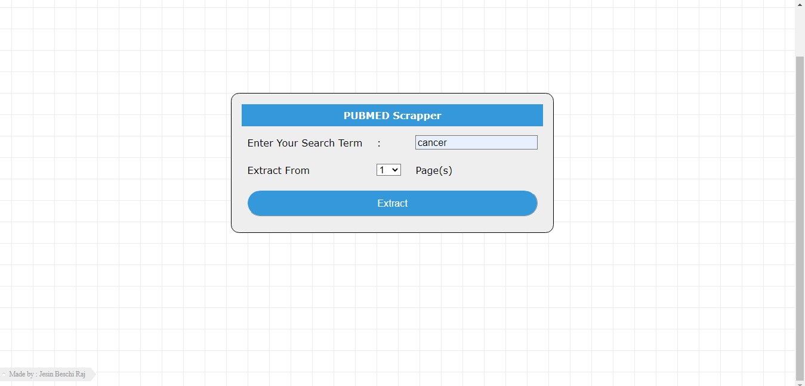
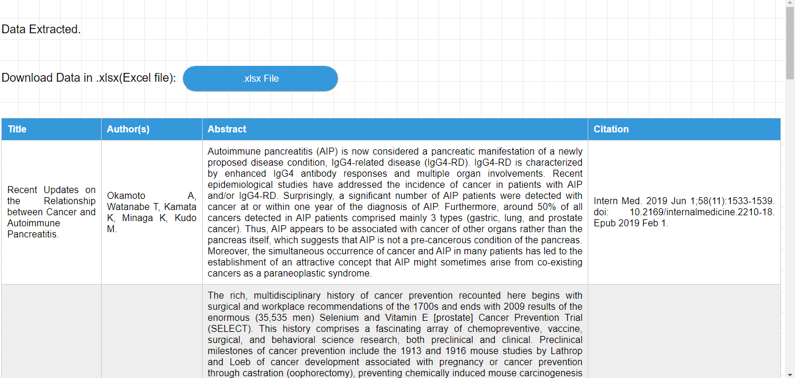

# website-scrapper-web-application
PUBMED.gov scrapper. Built in the Django framework as a web appliciation.

Brief about the project:
 It basically collects data (scrape) like title, abstract e.t.c., from the pubmed website
 and puts them in a excel file.

Tools used : Python, Django Framework, Html, CSS.

## Website Preview:
### HomePage:

 
  <kbd>
    
  </kbd>

### SummaryPage:

 
  <kbd>
    
  </kbd>

## Notes:
1) Typical Django project. (MVT)
2) Run the django project.
3) Enter the search term and select how many pages to render and extract.
4) Depending on the number of pages , it takes some time to load. (5 pages requires 40 secs to load)
5) Extracted content will be displayed in a Table.
6) What contents are extracted? Title, Author(s), Abstract and Citation.
7) The pubmed site link is: https://pubmed.ncbi.nlm.nih.gov/
8) When the .xlsx button is clicked, a Excelsheet with the extracted data is downloaded.
9) Application logic/Backend processes are defined in views.py.
10) The 'templates' folder has the html files.

## Work yet to be done:
1) The inputs need validation.
2) For "number of pages" input need a different input method instead of the combo box I've used.
3) UI improvements.
4) Need to implement correct spacing and remove empty spaces in the excelsheet download.
##
Made By Jesin Beschi Raj --

